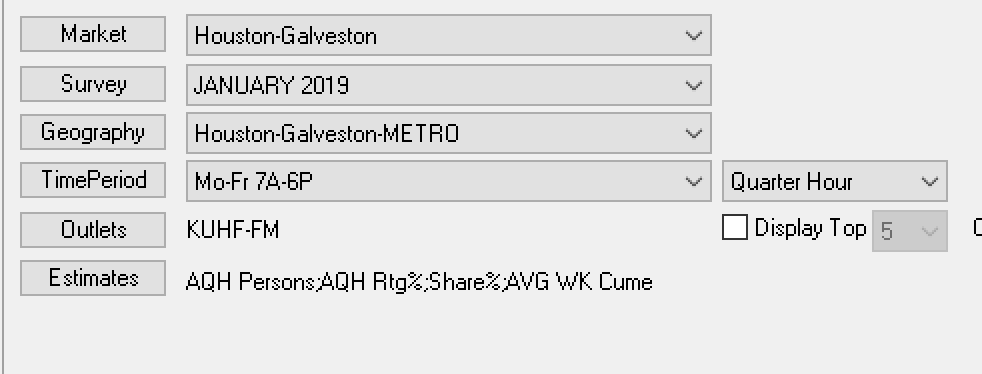
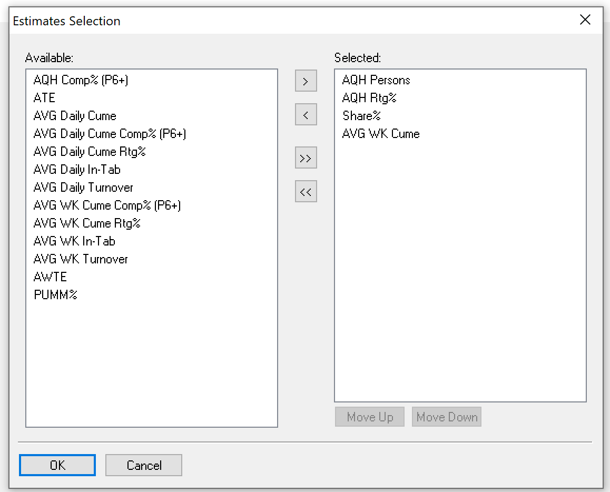
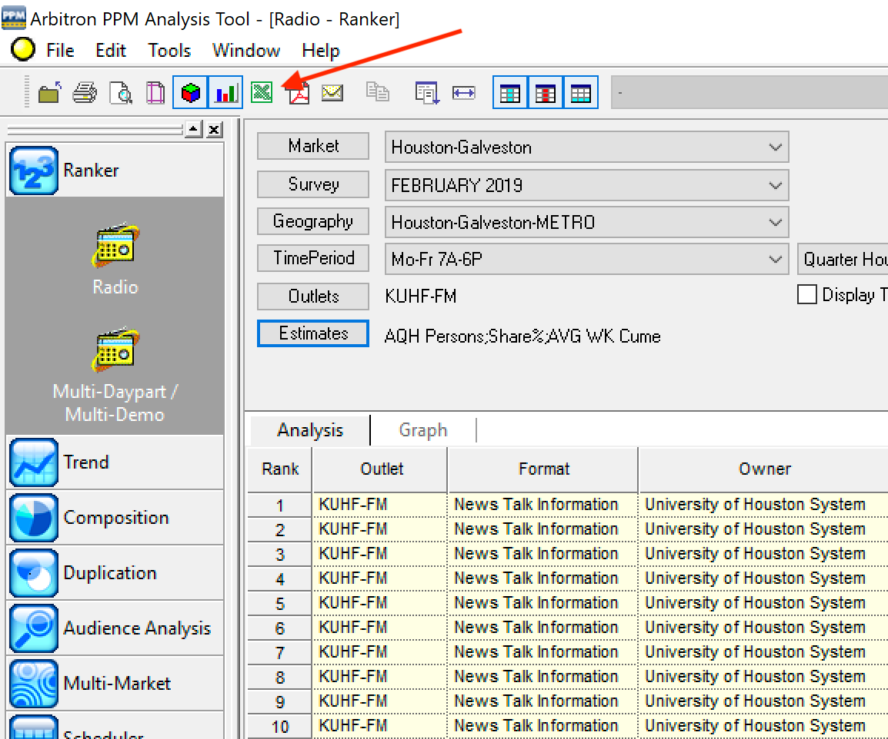
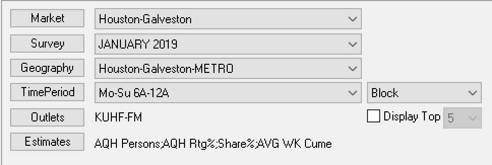

# Texas News Hub Newcast Analytics

## Overview
This application was built to help visualize and aggregate newscast analytics for the stations in the Texas News Hub project. It is broken into 2 parts: a PHP-based parser that can receive reports from the PPM Analysis Tool, and a Vue.js/Chart.js-powered visualization application. Below is a walkthrough on how to use it.

## Walkthrough

### Reports

<ol>
	<li>Open PPM Analysis Tool. As it is only available for Windows machines, macOS users will either have to find a separate machine or set up a virtual machine. If you go the virtual machine route, <a href="https://developer.microsoft.com/en-us/microsoft-edge/tools/vms/">Microsoft offers some basic VMs that you can download and use for free</a> for the various virtualization platforms. <a href="https://www.virtualbox.org/wiki/Downloads">VirtualBox is available for free also.</a></li>
	<li>Open the Ranker section and click "Radio." Here is a screenshot of our report setup. If you can match this without any other help, <a href="#step-3">you can skip to step 3</a>.<br /><br />
		<ol>
			<li>First, define your market. Depending on the data sets you have access to, you should only have access to one market. If it doesn't appear in the dropdown, click the <code>Market</code> button and select it.</li>
			<li>Select your survey. You can run several surveys at once, but you can only view or export results one survey at a time. If you already have surveys in the dropdown, select the survey you want to run your report on. Otherwise, click the <code>Survey</code> button. In the popup, select the "Monthly" tab, highlight the month you wish to report on, and either double-click or click the right arrow to select.<br /></li>
			<li>Select your Geography. I usually pull the METRO Geography (as opposed to DMA), but we should decide as a group to be consistent.</li>
			<li>Select your TimePeriod.  We will need to create a custom period, so click on the <code>TimePeriod</code> button. In the popup, click the "Custom" tab, select "Monday" for your Start Day, "Friday" for your End Day, Start Time of 7AM, End Time of 6PM, and select "Avg. All" under Day Selection. Click the <code>Select</code> button to enter it into the "Selected" pane below. You can also add it to your favorites, if you want.<br /><br /><strong><em>Make sure that the secondary dropdown on TimePeriod is set to "Quarter Hour." Very important.</em></strong><br /></li>
			<li>Select your Outlet. Please only select one outlet at a time, since it will skew the Analysis Totals otherwise.</li>
			<li>Select your Estimates by clicking the <code>Estimates</code> button. The reporting is currently set up to accept "AQH Persons," "AQH RTG%", "Share%," and "AVG WK Cume." Once you have moved them into the "Selected" pane, you can order them as pictured or not. The parsing script will figure it out.<br /></li>
			<li>Select the rest of the reporting options: Target to "P 6+", Location to "Both In/Out of Home", Listening to "Threshold Not Set".<br /></li>
		</ol>
	</li>
	<li id="step-3"><strong><em>If you already have your reporting setup in place, skip to here</em></strong><br />Click the <code>Run Analysis</code> button.</li>
	<li>Click the <code>Excel</code> icon in the toolbar up top. In the popover, select "Export to a New Excel File" and click <code>Finish</code>. You can name the file whatever you want, it doesn't matter.<br /><br /></li>
	<li>You will also want to run a more broad "run-of-station" report, which will flow into the "Broadcast Overview" section of the graphing app. It is the same report as above, but it should be run on a <code>TimePeriod</code> of Monday-Sunday, 6AM - 12AM. After you create the TimePeriod, select "Block" from the dropdown, click <code>Run Analysis</code>, and export to an Excel file.<br /></li>
	<li>In your browser of choice, go to <a href="https://analytics.hpm.io/hub/upload/">the News Hub upload page</a>, and enter the password you've been given.</li>
	<li>Drag-and-drop your file into the dropzone, or click in the dropzone to bring up a file picker. You can upload multiple files at a time, as long as the files contain one month's data for one station.<br /></li>
</ol>

## Installation

### Hub Vue App
This app is built in Vue.js, using the Vue CLI, which can be [installed using the instructions on this page](https://cli.vuejs.org/).
1. Clone the repository to your local machine.
2. Open a terminal and type `vue ui`, which will pop up the Vue.js project UI in a browser.
3. Click the dropdown in the upper left and select "Vue Project Manager." 
4. Click `import` and navigate to the "hub-app" folder in the cloned repo.
5. Once it is imported, you use the Tasks menu to serve a compiled version for testing and editing, and to build out a new version.

### Hub Uploader
This is a PHP application that manages dependencies with Composer.
1. Clone the repository to your local machine.
2. Open a terminal, navigate to the "hub-uploader" folder of the cloned repo, and type `composer install`.
3. Rename `.env.sample` to `.env`. Update the password you want the app to use, and also the folder that you want the data stored in.

## Installation on a Server
Currently, these two apps are stored like this on the server:
```
/hub/
   ↘️ /css/
   ↘️ /data/    < This is where the parsed PPM data lives
   ↘️ /js/
   ↘️ /upload/  < This is where the Uploader app lives
      ↘️ .env
      ↘️ index.php
      ↘️ upload.php
   ↘️ index.html
```
This means that the DATA_PATH referenced in the `.env` file would be `../data/`.

## Wishlist

This project is a work in progress. If you have ideas or run into problems, open an issue!

## Questions

Contact me at jcounts@houstonpublicmedia.org.